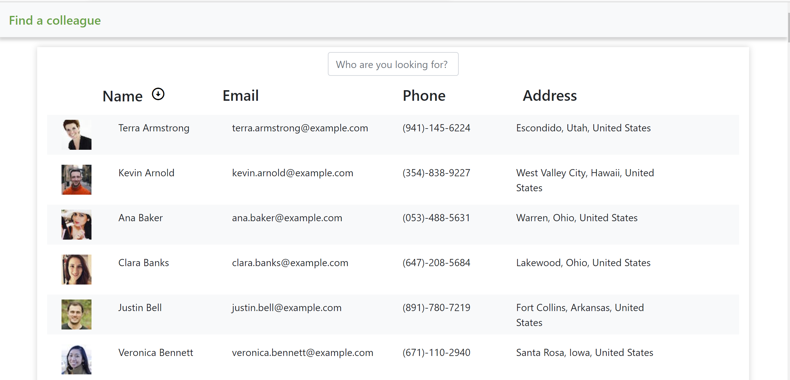

# Employee Directory

## Description
  
A React app making use of states and conditional rendering to search and filter a simple directory.
A [deployed version](https://mhemployeedir.herokuapp.com/) of the app can be found here.
  
## Table of Contents
  
* [Description](#description)
* [Installation](#installation)
* [Usage](#usage)
* [License](#license)
* [Contributing](#contributing)
* [Tests](#tests)
* [Questions](#questions)
  
## Installation
  
This is a nodejs app, so needs the usual node installation steps of npm install and npm start.There is no need for a database connection to use this version of the code, however, to use this on a live database,t he connectivity to the database should be build.
  
## Usage
  
As a user, I want to be able to view my entire employee directory at once so that I have a quick access to their information. An employee or manager would benefit greatly from being able to view non-sensitive data about other employees. It is particularly useful to be able to search for a colleague by name or sort them in alphabetical order.

  
## License
  
The application is released under the MIT license.
  
## Contributing
  
To contribute to this application, create a pull request. Here are the steps needed for doing that:

* Fork the repo
* Create a feature branch (git checkout -b NAME-HERE)
* Commit your new feature (git commit -m 'Add some feature')
* Push your branch (git push)
* Create a new Pull Request
        
Following a code review, your feature will be merged.
  
## Tests
  
There are no project specific tests provided.
  
## Questions
  
Link to author's [gitHub profile](https://github.com/maria-helbling).
